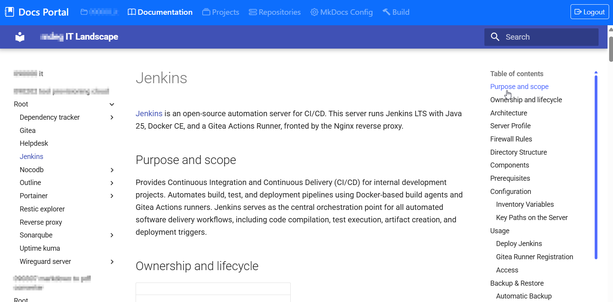
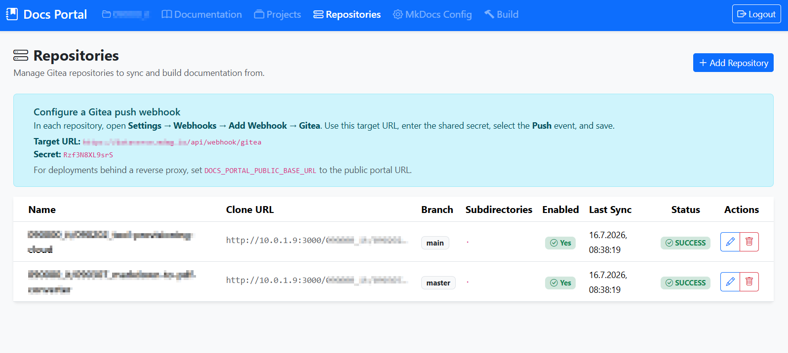
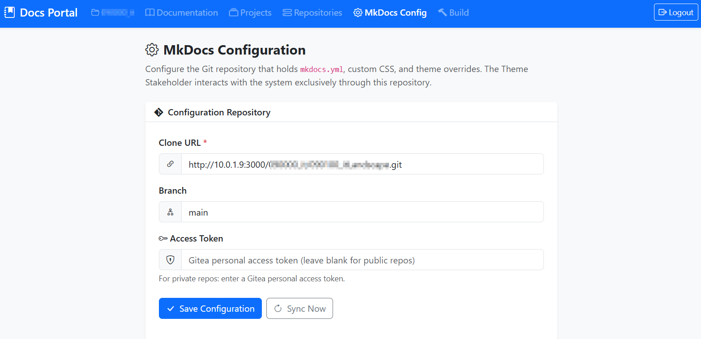
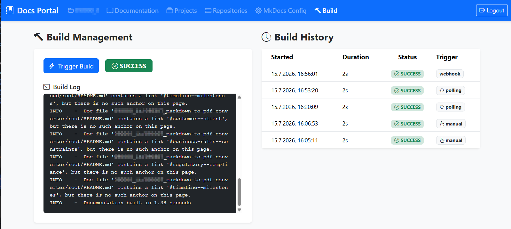
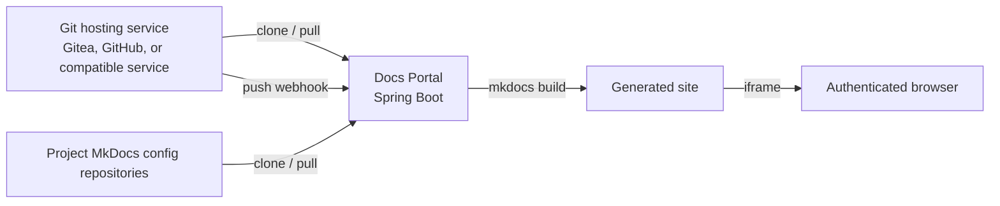

# Docs Portal

Docs Portal collects Markdown documentation from multiple Git repositories,
builds a unified MkDocs Material site, and serves it through an authenticated
Spring Boot application.

The application is designed for teams whose documentation lives beside code,
infrastructure, and operational repositories. Administrators configure source
repositories and builds in the portal; authors continue working in Git and
their preferred Git hosting service.

## Features

- Synchronizes configured Git repositories using clone and pull.
- Supports a branch and one or more documentation subdirectories per
  repository, including the repository root (`.`).
- Organizes repositories, MkDocs configuration, build history, workspaces, and
  generated documentation into isolated projects.
- Includes a seeded **Default Project** so existing installations work without
  additional setup.
- Uses a dedicated Git repository as the source of truth for `mkdocs.yml`,
  theme overrides, CSS, and shared landing pages.
- Builds Markdown with MkDocs Material and serves the generated site inside a
  full-size iframe. MkDocs provides the sidebar, search, table of contents,
  and all documentation navigation.
- Supports push webhooks for immediate synchronization and a five-minute
  polling fallback.
- Preserves the previous successful site when a build or publish fails.
- Provides Admin and Viewer roles, CSRF protection for browser state changes,
  HMAC verification for webhooks, and login rate limiting.
- Shows build status, logs, and the most recent 20 build records in the Admin
  UI.

## Screenshots

### Unified documentation

The authenticated documentation view embeds the generated MkDocs Material
site, including its navigation, search, and table of contents.



### Repository and webhook configuration

Configure the repositories that provide documentation and copy the displayed
webhook URL and secret to trigger builds on push.



### MkDocs configuration repository

Use a dedicated Git repository for `mkdocs.yml`, shared pages, custom CSS, and
theme overrides.



### Build management

Trigger builds manually, inspect the current build output, and review recent
build history in one place.



## Architecture



## Prerequisites

- Docker Engine with Docker Compose v2 for deployment.
- A Git hosting service reachable from the portal, such as Gitea or GitHub.
- A personal access token or SSH setup for any private source or configuration
  repositories.
- A dedicated MkDocs configuration repository containing at least
  `mkdocs.yml`. See [MkDocs configuration](#mkdocs-configuration).

## Quick start with Docker Compose

1. Clone the repository and create an environment file.

   ```bash
   git clone https://github.com/tmseidel/atlas-doc.git
   cd atlas-doc
   touch .env
   ```

2. Set strong credentials and a long webhook secret in `.env`.

   ```dotenv
   DOCS_PORTAL_AUTH_ADMIN_USERNAME=admin
   DOCS_PORTAL_AUTH_ADMIN_PASSWORD=replace-with-a-strong-password
   DOCS_PORTAL_AUTH_VIEWER_USERNAME=viewer
   DOCS_PORTAL_AUTH_VIEWER_PASSWORD=replace-with-a-strong-password
   GITEA_WEBHOOK_SECRET=replace-with-a-long-random-secret
   DOCS_PORTAL_PUBLIC_BASE_URL=https://docs.example.com
   ```

   `DOCS_PORTAL_PUBLIC_BASE_URL` is optional for a local installation. Set it
   in production so the portal displays the correct public webhook URL when it
   runs behind a reverse proxy.

3. Build and start the portal.

   ```bash
   docker compose --env-file .env up -d --build
   ```

4. Open `http://localhost:8080`, sign in as the Admin user, and complete the
   setup described below.

Useful commands:

```bash
docker compose logs -f docs-portal
docker compose ps
docker compose down
```

The Compose deployment persists these directories on the host:

| Directory | Purpose |
|---|---|
| `workspace/` | Project-scoped cloned documentation repositories |
| `mkdocs-config/` | Project-scoped MkDocs configuration checkouts |
| `site/` | Project-scoped generated MkDocs sites |
| `data/` | H2 database with portal configuration and build history |

Back up `data/` and, if repository checkout recovery matters, the other
mounted directories before upgrading or moving the deployment.

## First-time administration

### 1. Select or create a project

The login screen lists available projects. Select the project you want to
enter before signing in. New installations include **Default Project**.

Admins can open **Projects** to create and edit projects, then use **Open** to
switch their active project. Switching projects changes the context for every
following screen; repository lists, MkDocs configuration, build logs, history,
health information, and the documentation iframe never show another project's
data.

Each project has its own on-disk checkout, working directory, and generated
site. The Default Project continues to use the original root directories for a
non-disruptive upgrade; other projects are stored in directories named after
their project ID.

### 2. Configure the MkDocs configuration repository

Open **MkDocs Config** in the Admin navigation and enter the dedicated Git
repository's clone URL, branch, and access token if it is private. The portal
clones this repository before each build.

The repository must contain `mkdocs.yml`. Its `docs/` directory is merged
into the build working directory, making it a good place for a shared
`index.md`, shared assets, and theme overrides.

### 3. Add documentation repositories

Open **Repositories** and add each source repository. Although the current UI
uses Gitea terminology, any Git host that provides a standard clone URL is
supported:

- **Name**: a stable, unique namespace in the generated documentation.
- **Clone URL**: the Git host's SSH or HTTPS clone URL.
- **Branch**: defaults to `main`.
- **Subdirectories**: comma-separated paths such as `docs`, `wiki`, or `.`
  for the repository root.
- **Access token**: required for private HTTPS repositories, such as a Gitea
  or GitHub personal access token.

Use **Test Connection** before saving a new repository. When editing an
existing repository, leaving the token empty reuses the saved token for both
the connection test and subsequent synchronization.

### 4. Trigger the initial build

Open **Build** and select **Trigger Build**. The page automatically refreshes
the status, current log, and history while the build runs. A failed build keeps
the last successful documentation site online.

## Git provider webhook setup

Configure a push webhook for every source repository in the active project. The portal accepts the
standard `X-Hub-Signature-256` HMAC header used by Gitea and GitHub.

1. Copy the **Target URL** and **Secret** shown in the portal's
   **Repositories** page.
2. Create a webhook in your Git host:

   - **Gitea**: **Settings → Webhooks → Add Webhook → Gitea**.
   - **GitHub**: **Settings → Webhooks → Add webhook**; set the content type
     to `application/json`.

3. Set the copied Target URL as the payload URL and the copied Secret as the
   webhook secret.
4. Select only the **Push** event.
5. Save the webhook and use the host's test delivery feature if available.

For GitHub, the payload URL is commonly displayed as **Payload URL**. For
Gitea, it is commonly displayed as **Target URL**.

The webhook endpoint is `POST /api/webhook/gitea`; the endpoint name is kept
for backwards compatibility and works with either provider. It does not use a
browser session; it validates the webhook HMAC signature with
`GITEA_WEBHOOK_SECRET` instead. The environment-variable name is likewise
retained for backwards compatibility. Polling remains enabled as a fallback
for missed webhook deliveries.

Webhook deliveries are matched to configured repository names and trigger only
the corresponding project build. Use the repository name (or its final path
segment) consistently between the Git host webhook payload and the portal
configuration.

## MkDocs configuration

Keep MkDocs configuration in the dedicated configuration repository rather
than modifying the application image. A minimal example is:

```yaml
site_name: Company Documentation
docs_dir: docs

theme:
  name: material

markdown_extensions:
  - pymdownx.superfences:
      custom_fences:
        - name: mermaid
          class: mermaid
          format: !!python/name:pymdownx.superfences.fence_code_format
```

This configuration enables Mermaid diagrams written as fenced `mermaid` code
blocks. Theme files, CSS, and other MkDocs assets can be kept in the same
repository.

## Deploying the published image

Every push to `main` builds and publishes the Docker image through GitHub
Actions to GitHub Container Registry:

```text
ghcr.io/tmseidel/atlas-doc:<version-from-pom.xml>
ghcr.io/tmseidel/atlas-doc:latest
```

For a production deployment, replace the `build: .` entry in
`docker-compose.yml` with the desired published image, for example:

```yaml
services:
  docs-portal:
    image: ghcr.io/tmseidel/atlas-doc:0.0.1-SNAPSHOT
```

Then pull and start it with the same environment file and volume mappings:

```bash
docker compose --env-file .env pull
docker compose --env-file .env up -d
```

For private GHCR packages, authenticate the host before pulling:

```bash
echo "$GITHUB_TOKEN" | docker login ghcr.io -u YOUR_GITHUB_USERNAME --password-stdin
```

Place the portal behind an HTTPS reverse proxy in production. Set
`DOCS_PORTAL_PUBLIC_BASE_URL` to the externally reachable HTTPS URL and ensure
Gitea can reach that URL.

## Configuration reference

| Variable | Purpose | Default |
|---|---|---|
| `DOCS_PORTAL_AUTH_ADMIN_USERNAME` | Admin login name | `admin` |
| `DOCS_PORTAL_AUTH_ADMIN_PASSWORD` | Admin login password | `admin` |
| `DOCS_PORTAL_AUTH_VIEWER_USERNAME` | Read-only login name | `viewer` |
| `DOCS_PORTAL_AUTH_VIEWER_PASSWORD` | Read-only login password | `viewer` |
| `GITEA_WEBHOOK_SECRET` | Shared HMAC secret for webhooks from any supported Git provider | Development-only default |
| `DOCS_PORTAL_PUBLIC_BASE_URL` | Public portal URL used in webhook guidance | Request URL |
| `DOCS_PORTAL_WORKSPACE_DIR` | Local Git checkout directory | `./workspace` |
| `DOCS_PORTAL_MKDOCS_CONFIG_DIR` | MkDocs configuration checkout directory | `./mkdocs-config` |
| `DOCS_PORTAL_MKDOCS_WORKING_DIR` | Temporary MkDocs working directory | `./mkdocs-working` |
| `DOCS_PORTAL_SITE_DIR` | Generated site directory | `./site` |
| `DOCS_PORTAL_MKDOCS_COMMAND` | MkDocs executable | `mkdocs` |
| `DOCS_PORTAL_POLL_INTERVAL_MS` | Fallback synchronization interval | `300000` |

Do not use the default credentials or webhook secret outside local evaluation.

## Development and verification

Run the application locally with Maven:

```bash
mvn spring-boot:run
```

Run the test suite and package the application:

```bash
mvn test
mvn package
```

The Docker image performs its own Maven package step and includes Git, Python,
MkDocs, and MkDocs Material at runtime.
