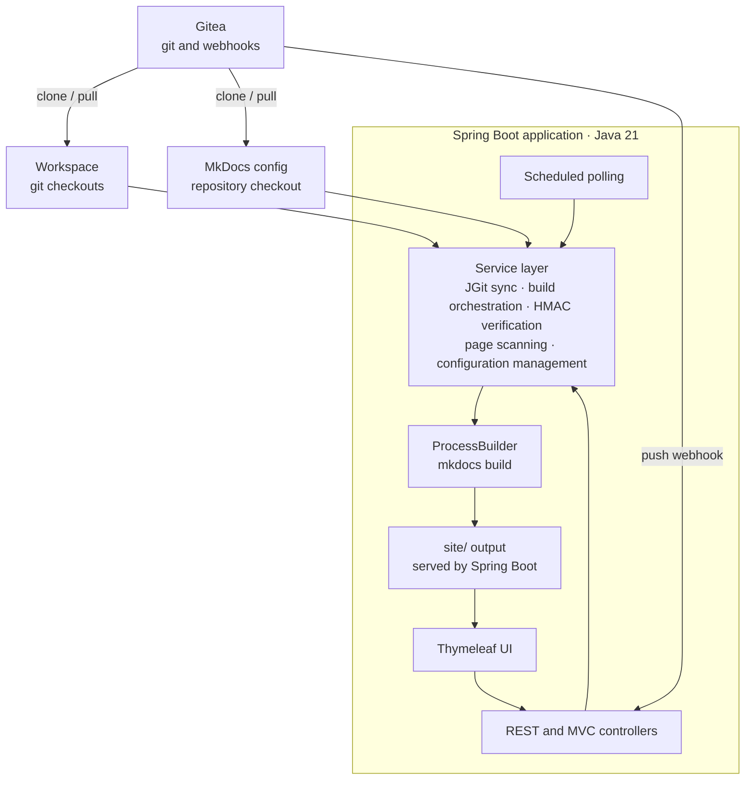

# Software Architecture Specification — Docs Portal (Monolithic Spring Boot)

**Document ID:** SAS-DP-003
**Version:** 1.1
**Status:** Revised — aligned with SRS-DP-001

---

## 1. Introduction

### 1.1 Purpose

This document describes the architecture of **Docs Portal**, a monolithic Spring Boot application that aggregates Markdown documents from multiple Gitea repositories, triggers MkDocs builds, and serves the resulting HTML through a Thymeleaf frontend. Everything runs in a single Java process — no separate build daemon, no separate frontend.

### 1.2 Scope

Single-process architecture: Spring Boot handles authentication, REST API, Thymeleaf UI, git synchronization, build orchestration, scheduling, and static file serving. MkDocs runs as a subprocess (or in a sidecar container) triggered by Spring Boot.

---

## 2. System Architecture

### 2.1 High-Level Architecture



### 2.2 Component Overview

| Component | Technology | Responsibility |
|---|---|---|
| Spring Boot App | Java 21, Spring Boot 4.x, Thymeleaf, Maven, Lombok | Everything: UI, API, auth, git sync, build orchestration, scheduling, webhook handling |
| MkDocs | subprocess (Docker or native) | Markdown → HTML transformation, triggered by Spring Boot |
| Workspace | Local directories | Git checkouts of content repos and MkDocs config repo |

### 2.3 Project Isolation

`Project` is the top-level tenant boundary. `RepositoryConfig`,
`MkDocsConfigRepo`, and `BuildRecord` each reference exactly one project. A
fresh database initialization creates a **Default Project**.

The selected project ID is stored in the authenticated HTTP session. The login
form requires a project selection; the Admin Projects page creates, edits, and
switches the active context. All repository, configuration, health, build, and
generated-site queries filter by this ID.

`ProjectPaths` resolves project-specific workspace, MkDocs config, working,
and site directories. To preserve existing installations, Default Project uses
the legacy root directories; other projects use a directory named by project
ID below each root.

---

## 3. Component Design

### 3.1 Project Structure

```
docs-portal/
├── pom.xml
├── Dockerfile
├── src/main/java/com/mdeg/docsportal/
│   ├── DocsPortalApplication.java       # @SpringBootApplication + @EnableScheduling
│   ├── config/
│   │   ├── SecurityConfig.java          # Spring Security: session auth, CSRF
│   │   ├── WebConfig.java              # Webjar resource mappings
│   │   └── RateLimitingFilter.java     # Login rate limiting
│   ├── controller/
│   │   ├── AuthController.java          # GET/POST /login, POST /logout
│   │   ├── DocsController.java          # GET /docs (MkDocs iframe)
│   │   ├── SiteContentController.java   # GET /site/** (generated MkDocs files)
│   │   ├── AdminRepoController.java     # CRUD /admin/repos
│   │   ├── AdminMkdocsController.java   # GET/POST /admin/mkdocs-config
│   │   ├── AdminBuildController.java    # POST /admin/build/trigger, log viewer
│   │   ├── WebhookController.java       # POST /api/webhook/gitea
│   │   └── ApiHealthController.java     # GET /api/health, /api/build/status
│   ├── model/
│   │   ├── entity/
│   │   │   ├── RepositoryConfig.java    # @Entity
│   │   │   ├── MkDocsConfigRepo.java    # @Entity (singleton)
│   │   │   └── BuildRecord.java         # @Entity
│   │   └── dto/
│   │       ├── RepositoryConfigDto.java
│   │       ├── DocPageDto.java
│   │       ├── HealthStatusDto.java
│   │       └── WebhookConfigDto.java
│   ├── repository/
│   │   ├── RepositoryConfigJpaRepository.java
│   │   ├── MkDocsConfigRepoJpaRepository.java
│   │   └── BuildRecordJpaRepository.java
│   ├── service/
│   │   ├── GitSyncService.java          # JGit clone/pull, SHA tracking
│   │   ├── MkDocsBuildService.java      # ProcessBuilder → mkdocs build
│   │   ├── BuildOrchestrator.java       # Coordinates sync → build → status
│   │   ├── WebhookService.java          # HMAC verification
│   │   ├── DocScannerService.java       # Scans site/ for pages
│   │   └── MkDocsConfigService.java     # MkDocs config repo management
│   └── util/
│       ├── GiteaHmacVerifier.java
│       └── PathSanitizer.java
├── src/main/resources/
│   ├── application.yml
│   ├── application-docker.yml
│   ├── templates/
│   │   ├── layout.html
│   │   ├── login.html
│   │   ├── docs.html                    # iframe + rebuilding overlay
│   │   ├── admin/
│   │   │   ├── repos.html
│   │   │   ├── mkdocs-config.html
│   │   │   └── build.html
│   └── static/
│       ├── css/docs-portal.css
│       └── js/polling.js                # Build status polling
├── workspace/                            # git checkouts (docker volume or bind mount)
├── mkdocs-config/                        # MkDocs config repo checkout
├── mkdocs-working/                       # Build working directory
└── site/                                 # MkDocs output (served as static resources)
```

### 3.2 Scheduling

All scheduling is handled by Spring's `@Scheduled` — no external daemon needed.

```java
// service/BuildOrchestrator.java
@Service
@RequiredArgsConstructor
@Slf4j
public class BuildOrchestrator {

    private final GitSyncService gitSyncService;
    private final MkDocsBuildService mkDocsBuildService;
    private final BuildRecordJpaRepository buildRecordRepo;
    private final MkDocsConfigRepoJpaRepository mkdocsConfigRepoDao;

    /** Fallback polling every 5 minutes. Webhooks are the primary trigger. */
    @Scheduled(fixedRateString = "${docs-portal.poll-interval-ms:300000}")
    public void periodicSyncAndBuild() {
        log.debug("Periodic sync check");
        runSyncAndBuildIfChanged("polling");
    }

    /** Called by webhook handler or admin trigger. */
    @Async
    public CompletableFuture<Void> triggerBuild(String triggerType, String repoName) {
        log.info("Build triggered: {} for repo: {}", triggerType, repoName);
        runSyncAndBuildIfChanged(triggerType);
        return CompletableFuture.completedFuture(null);
    }

    private synchronized void runSyncAndBuildIfChanged(String triggerType) {
        // 1. Check if build already running
        if (isBuildRunning()) {
            log.debug("Build already running, skipping");
            return;
        }

        // 2. Git pull all content repos + MkDocs config repo
        boolean changed = gitSyncService.syncAllRepositories();

        // 3. Also pull MkDocs config repo
        boolean mkdocsChanged = gitSyncService.syncMkDocsConfigRepository();

        // 4. Build only if something changed
        if (changed || mkdocsChanged) {
            mkDocsBuildService.runBuild(triggerType);
        } else {
            log.debug("No changes detected, skipping build");
        }
    }
}
```

### 3.3 Git Synchronization (JGit)

```java
// service/GitSyncService.java
@Service
@RequiredArgsConstructor
@Slf4j
public class GitSyncService {

    private final RepositoryConfigJpaRepository repoDao;
    private final MkDocsConfigRepoJpaRepository mkdocsConfigDao;

    @Value("${docs-portal.workspace-dir}")
    private Path workspaceDir;

    /**
     * Pulls all configured content repositories.
     * Returns true if any repository had new commits.
     */
    public boolean syncAllRepositories() {
        boolean anyChanged = false;
        for (var repo : repoDao.findByEnabledTrue()) {
            boolean changed = pullRepository(repo.getCloneUrl(), repo.getBranch(),
                    workspaceDir.resolve(repo.getName()), repo.getName());
            if (changed) {
                repo.setLastSyncAt(Instant.now());
                repo.setLastSyncStatus(SyncStatus.SUCCESS);
                repoDao.save(repo);
                anyChanged = true;
            }
        }
        return anyChanged;
    }

    /**
     * Pulls or clones a single repository.
     * Compares HEAD SHA before/after to detect changes.
     */
    private boolean pullRepository(String url, String branch, Path targetDir, String repoName) {
        try {
            String oldHead = getHeadSha(targetDir);

            if (Files.exists(targetDir.resolve(".git"))) {
                // Pull existing checkout
                Git.open(targetDir.toFile()).pull()
                    .setRemoteBranchName(branch)
                    .call();
            } else {
                // Clone
                Git.cloneRepository()
                    .setURI(url)
                    .setBranch(branch)
                    .setDirectory(targetDir.toFile())
                    .call();
            }

            String newHead = getHeadSha(targetDir);
            return !Objects.equals(oldHead, newHead);

        } catch (Exception e) {
            log.error("Failed to sync repo {}: {}", repoName, e.getMessage());
            // Update status to FAILED in DB
            return false;
        }
    }

    private String getHeadSha(Path repoDir) {
        if (!Files.exists(repoDir.resolve(".git"))) return null;
        try (var git = Git.open(repoDir.toFile())) {
            return git.getRepository().resolve("HEAD").name();
        } catch (IOException e) {
            return null;
        }
    }
}
```

### 3.4 MkDocs Build Service

```java
// service/MkDocsBuildService.java
@Service
@RequiredArgsConstructor
@Slf4j
public class MkDocsBuildService {

    private final BuildRecordJpaRepository buildRecordRepo;
    private final RepositoryConfigJpaRepository repoDao;

    @Value("${docs-portal.workspace-dir}")
    private Path workspaceDir;

    @Value("${docs-portal.mkdocs-working-dir}")
    private Path mkdocsWorkingDir;

    @Value("${docs-portal.site-dir}")
    private Path siteDir;

    @Value("${docs-portal.mkdocs-config-dir}")
    private Path mkdocsConfigDir;

    @Value("${docs-portal.mkdocs-command:mkdocs}")
    private String mkdocsCommand;

    /**
     * Prepares the MkDocs working directory, runs the build, and safely publishes it.
     */
    public void runBuild(String triggerType) {
        var record = BuildRecord.builder()
            .status(BuildStatus.RUNNING)
            .startedAt(Instant.now())
            .trigger(BuildTrigger.valueOf(triggerType.toUpperCase()))
            .build();
        buildRecordRepo.save(record);

        try {
            // 1. Prepare docs/ directory: mirror repos with multi-subdirectory support
            prepareDocsDirectory();

            // 2. Merge config repo docs/ into working docs/ (provides index.md etc.)
            mergeConfigRepoDocs();

            // 3. Copy mkdocs.yml and all config-repository theme assets
            copyMkDocsConfig();

            // 4. Run mkdocs build → isolated site.new/ output
            Path outputDir = siteDir.resolveSibling(siteDir.getFileName() + ".new");
            var process = new ProcessBuilder(
                mkdocsCommand, "build",
                "--config-file", mkdocsWorkingDir.resolve("mkdocs.yml").toString(),
                "--site-dir", outputDir.toString()
            )
            .directory(mkdocsWorkingDir.toFile())
            .redirectErrorStream(true)
            .start();

            // Capture log output
            String logOutput = new String(process.getInputStream().readAllBytes());
            int exitCode = process.waitFor();

            if (exitCode == 0) {
                // Verify and publish; retain the previous site if publishing fails.
                swapSiteDirectories(siteDir, outputDir);
                record.setStatus(BuildStatus.SUCCESS);
            } else {
                // Keep old site/, record failure
                FileUtils.deleteDirectory(outputDir.toFile());
                record.setStatus(BuildStatus.FAILED);
            }

            record.setLogPath("/build/logs/build-" + Instant.now().getEpochSecond() + ".log");
            record.setFinishedAt(Instant.now());
            buildRecordRepo.save(record);

        } catch (Exception e) {
            log.error("Build failed", e);
            record.setStatus(BuildStatus.FAILED);
            record.setFinishedAt(Instant.now());
            buildRecordRepo.save(record);
        }
    }

    /**
     * Mirrors configured repos under mkdocs-working/docs/.
     * Multi-subdirectory support: each subdirectory gets its own namespace.
     */
    private void prepareDocsDirectory() throws IOException {
        Path docsDir = mkdocsWorkingDir.resolve("docs");
        FileUtils.deleteDirectory(docsDir.toFile());
        Files.createDirectories(docsDir);

        for (var repo : repoDao.findByEnabledTrue()) {
            Path repoDocsDir = docsDir.resolve(repo.getName());
            Files.createDirectories(repoDocsDir);

            for (String subDir : repo.getSubdirectories()) {
                String targetName = sanitizeSubdirectoryName(subDir);
                Path sourcePath = workspaceDir.resolve(repo.getName()).resolve(subDir);
                Path targetPath = repoDocsDir.resolve(targetName);

                if (Files.exists(sourcePath)) {
                    FileUtils.copyDirectory(sourcePath.toFile(), targetPath.toFile());
                }
            }
        }
    }

    private String sanitizeSubdirectoryName(String subDir) {
        if (".".equals(subDir)) return "root";
        return subDir.replaceAll("[^a-zA-Z0-9_-]", "_").replaceAll("/+$", "");
    }

    private void swapSiteDirectories(Path currentSite, Path newSite) throws IOException {
        verifySite(newSite, "new build output");
        Path backup = currentSite.resolveSibling(currentSite.getFileName() + ".previous");
        copyDirectory(currentSite, backup);
        try {
            deleteDirectoryContents(currentSite);
            copyDirectory(newSite, currentSite);
            verifySite(currentSite, "published site");
        } catch (Exception publishFailure) {
            deleteDirectoryContents(currentSite);
            copyDirectory(backup, currentSite);
            throw publishFailure;
        } finally {
            deleteRecursively(newSite);
            deleteRecursively(backup);
        }
    }
}
```

### 3.5 Webhook Handling

```java
// controller/WebhookController.java
@RestController
@RequestMapping("/api/webhook")
@RequiredArgsConstructor
@Slf4j
public class WebhookController {

    private final WebhookService webhookService;
    private final BuildOrchestrator buildOrchestrator;

    @Value("${docs-portal.webhook.secret}")
    private String webhookSecret;

    /**
     * Receives Gitea push events. HMAC-verified, CSRF-disabled.
     */
    @PostMapping("/gitea")
    public ResponseEntity<?> handleGiteaWebhook(
            @RequestHeader(value = "X-Hub-Signature-256", required = false) String signature,
            @RequestBody String payload) {

        if (!webhookService.verifySignature(signature, payload, webhookSecret)) {
            return ResponseEntity.status(HttpStatus.UNAUTHORIZED).build();
        }

        String repoName = webhookService.extractRepoName(payload);
        log.info("Webhook received for repo: {}", repoName);

        // Async: pull repo + rebuild
        buildOrchestrator.triggerBuild("webhook", repoName);

        return ResponseEntity.accepted().build();
    }
}
```

### 3.6 JPA Entities (Lombok)

```java
@Entity
@Table(name = "repositories")
@Data
@Builder
@NoArgsConstructor
@AllArgsConstructor
public class RepositoryConfig {

    @Id
    @GeneratedValue(generator = "uuid")
    @GenericGenerator(name = "uuid", strategy = "uuid2")
    private String id;

    @Column(nullable = false)
    private String name;

    @Column(name = "clone_url", nullable = false)
    private String cloneUrl;

    @Column(nullable = false)
    @Builder.Default
    private String branch = "main";

    /**
     * Subdirectory paths within the repo (e.g., ["docs/", "wiki/"]).
     * "." maps to "root/" in MkDocs docs/.
     */
    @Column(name = "subdirectories", columnDefinition = "JSON")
    @Convert(converter = StringListConverter.class)
    private List<String> subdirectories;

    @Builder.Default
    private Boolean enabled = true;

    @Column(name = "last_sync_at")
    private Instant lastSyncAt;

    @Column(name = "last_sync_status")
    @Enumerated(EnumType.STRING)
    private SyncStatus lastSyncStatus;

    @Column(name = "last_sync_error")
    private String lastSyncError;

    @Column(name = "created_at", updatable = false)
    private Instant createdAt;

    @Column(name = "updated_at")
    private Instant updatedAt;
}

@Entity
@Table(name = "mkdocs_config_repo")
@Data
@Builder
@NoArgsConstructor
@AllArgsConstructor
public class MkDocsConfigRepo {
    @Id
    @GeneratedValue(generator = "uuid")
    @GenericGenerator(name = "uuid", strategy = "uuid2")
    private String id;

    @Column(name = "clone_url", nullable = false)
    private String cloneUrl;

    @Column(nullable = false)
    @Builder.Default
    private String branch = "main";

    @Column(name = "last_sync_at")
    private Instant lastSyncAt;

    @Column(name = "last_sync_status")
    @Enumerated(EnumType.STRING)
    private SyncStatus lastSyncStatus;

    @Column(name = "last_sync_error")
    private String lastSyncError;

    @Column(name = "updated_at")
    private Instant updatedAt;
}

@Entity
@Table(name = "build_records")
@Data
@Builder
@NoArgsConstructor
@AllArgsConstructor
public class BuildRecord {
    @Id
    @GeneratedValue(generator = "uuid")
    @GenericGenerator(name = "uuid", strategy = "uuid2")
    private String id;

    @Enumerated(EnumType.STRING)
    private BuildStatus status;

    @Column(name = "started_at", nullable = false)
    private Instant startedAt;

    @Column(name = "finished_at")
    private Instant finishedAt;

    @Column(name = "log_path")
    private String logPath;

    @Enumerated(EnumType.STRING)
    private BuildTrigger trigger;
}
```

### 3.7 Security Configuration

Role-based access control with three user roles (per SRS section 2.2):

| Role | Access |
|---|---|
| **ADMIN** | Full access: `/admin/**`, repo CRUD, build triggers, webhook config |
| **THEME_STAKEHOLDER** | Not implemented in this Java app — interacts only via the MkDocs config Git repo (SRS BUILD-004, MKCFG-004) |
| **VIEWER** | Read-only: `/docs`, `/api/health`, `/api/build/status`, `/site/**` |

```java
@Configuration
@EnableWebSecurity
public class SecurityConfig {

    @Bean
    public SecurityFilterChain filterChain(HttpSecurity http) throws Exception {
        return http
            .csrf(csrf -> csrf
                .ignoringRequestMatchers("/api/webhook/gitea")
            )
            .authorizeHttpRequests(auth -> auth
                .requestMatchers("/login", "/css/**", "/js/**").permitAll()
                .requestMatchers("/api/webhook/gitea").permitAll()
                .requestMatchers("/admin/**", "/api/repositories/**", "/api/mkdocs-config/**",
                                 "/api/build/trigger", "/api/webhook/config").hasRole("ADMIN")
                .requestMatchers("/docs", "/api/health", "/api/build/status", "/site/**",
                                 "/api/doc-pages").authenticated()
                .anyRequest().authenticated()
            )
            .formLogin(form -> form
                .loginPage("/login")
                .loginProcessingUrl("/login")
                .defaultSuccessUrl("/docs", true)
            )
            .logout(logout -> logout
                .logoutUrl("/logout")
                .logoutSuccessUrl("/login?logout")
            )
            .sessionManagement(session -> session
                .maximumSessions(-1)
            )
            .build();
    }

    @Bean
    public UserDetailsService userDetailsService(
            @Value("${docs-portal.auth.admin.username}") String adminUsername,
            @Value("${docs-portal.auth.admin.password}") String adminPassword,
            @Value("${docs-portal.auth.viewer.username}") String viewerUsername,
            @Value("${docs-portal.auth.viewer.password}") String viewerPassword) {
        return new InMemoryUserDetailsManager(
            User.builder()
                .username(adminUsername)
                .password(adminPassword)
                .roles("ADMIN", "VIEWER")
                .build(),
            User.builder()
                .username(viewerUsername)
                .password(viewerPassword)
                .roles("VIEWER")
                .build()
        );
    }

    @Bean
    public PasswordEncoder passwordEncoder() {
        return new BCryptPasswordEncoder();
    }
}
```

The Admin user also receives the `VIEWER` role so they can access `/docs` and view documentation alongside administrative functions. The Viewer user only has the `VIEWER` role and cannot access any `/admin/**` or `/api/repositories/**` endpoints.

### 3.8 REST API

| Method | Path | Auth | Description |
|---|---|---|---|
| POST | `/login` | No | Spring Security form login |
| POST | `/logout` | Yes | Invalidate session |
| GET | `/api/health` | Auth (Admin+Viewer) | Build status, sync status, repo statuses |
| GET | `/api/doc-pages` | Auth (Admin+Viewer) | List available doc pages (from site/) |
| GET | `/api/repositories` | Admin | List repositories |
| POST | `/api/repositories` | Admin | Add repository |
| PUT | `/api/repositories/{id}` | Admin | Update repository |
| DELETE | `/api/repositories/{id}` | Admin | Remove repository |
| GET | `/api/mkdocs-config` | Admin | Get MkDocs config repo settings |
| PUT | `/api/mkdocs-config` | Admin | Update MkDocs config repo settings |
| POST | `/api/build/trigger` | Admin | Manually trigger build |
| GET | `/api/build/log` | Admin | Get build log |
| GET | `/api/build/status` | Auth (Admin+Viewer) | Current build status (polling) |
| GET | `/api/webhook/config` | Admin | Get webhook URL + secret |
| GET | `/site/{path}` | Auth (Admin+Viewer) | Serve MkDocs HTML (iframe src) |
| POST | `/api/webhook/gitea` | No* | Gitea webhook (*HMAC verified) |

### 3.9 MkDocs docs/ Directory Structure

```
workspace/repo-beta/                        mkdocs-working/docs/repo-beta/
├── docs/                         ──────►   ├── docs/
│   ├── getting-started.md                  │   └── getting-started/
│   └── api-reference.md                    └── wiki/
├── wiki/                         ──────►       └── faq/
│   └── faq.md
└── README.md                     ──────►   (if "." configured → root/)
```

Naming rules:
- Subdirectory name used directly (`docs/` → `docs/`, `wiki/` → `wiki/`)
- Repo root (`"."`) → `root/`
- Special chars → underscores (`my-docs/` → `my_docs/`)
- Collision → numeric suffix (`root/` exists → `root_1/`)

### 3.10 Thymeleaf Pages

| Page | URL | Description |
|---|---|---|
| Login | `/login` | Username/password form |
| Docs | `/docs` (with `/doc` redirect) | Full-size MkDocs iframe + rebuilding overlay |
| Admin — Repos | `/admin/repos` | Repo CRUD table + add/edit form |
| Admin — MkDocs Config | `/admin/mkdocs-config` | MkDocs config repo URL/branch form |
| Admin — Build | `/admin/build` | Trigger button, build log, status |

**No application-side navigation.** MkDocs Material Theme renders sidebar, search, and TOC inside the iframe. The app does NOT parse `mkdocs.yml`, does NOT render Markdown, does NOT build a nav tree.

---

## 4. Data Flows

### 4.1 Initial Setup

```
Admin → /admin/repos: Add repo (name, clone URL, branch, subdirectories)
Spring Boot: Test connection (JGit ls-remote)
Spring Boot: Save to DB
Admin → /admin/repos: Copy webhook URL + secret
Admin → Gitea: Create webhook in repo Settings
Admin → /admin/build: Click "Trigger Build"
BuildOrchestrator: git clone → workspace/
BuildOrchestrator: mkdocs build → isolated output → verified publish to site/
Thymeleaf UI: /docs shows MkDocs output in iframe
```

### 4.2 Webhook Flow (PRIMARY)

```
Gitea push → POST /api/webhook/gitea
  X-Hub-Signature-256 + JSON body

WebhookController:
  1. Verify HMAC signature
  2. Extract repo name from payload
  3. @Async → BuildOrchestrator.triggerBuild("webhook", repoName)

BuildOrchestrator (async, synchronized):
  1. Check: build already running? → skip
  2. GitSyncService: pull configured repositories and the MkDocs config repository
  3. Compare HEAD SHA → changed?
  4. If changed: MkDocsBuildService.runBuild("webhook")
     - Prepare docs/ (mirror repos)
     - Copy mkdocs.yml + theme assets
     - ProcessBuilder: mkdocs build → isolated output directory
     - Verify output and publish it while retaining the previous successful site on failure
  5. Update BuildRecord in DB

Thymeleaf UI polls /api/build/status every 3s:
  - RUNNING → show blocking overlay
  - completion → hide overlay and reload iframe
```

### 4.3 Polling Flow (FALLBACK)

```
@Scheduled(fixedRate = 300000):
  BuildOrchestrator.periodicSyncAndBuild()
    → Same logic as webhook, but pulls ALL repos
    → Only builds if any repo has new commits
```

---

## 5. Security

### 5.1 Authentication

- Spring Security session-based (JSESSIONID)
- BCrypt passwords from env vars
- CSRF enabled (except webhook endpoint)
- Multi-session support (Admin + Viewer can be logged in simultaneously)
- Role-based access control:
  - Admin (`docs-portal.auth.admin.username` / `docs-portal.auth.admin.password`) — full access, can view docs + manage system
  - Viewer (`docs-portal.auth.viewer.username` / `docs-portal.auth.viewer.password`) — read-only access to documentation and status

### 5.2 Credential Storage

| Credential | Storage |
|---|---|
| App password | Env var, BCrypt encoded |
| Gitea SSH keys | Docker secrets / host files (0400) |
| Gitea HTTPS tokens | Env vars |
| Webhook secret | Env var (`GITEA_WEBHOOK_SECRET`) |

### 5.3 Theme Stakeholder Isolation

The Theme Stakeholder only has access to the dedicated MkDocs config Git repo. They never touch the Spring Boot application, database, or credentials. Changes propagate via git push → Spring Boot build service pull → next build.

---

## 6. Deployment

### 6.1 Docker Compose

```yaml
services:
  docs-portal:
    build: .
    ports:
      - "8080:8080"
    volumes:
      - ./workspace:/app/workspace
      - ./mkdocs-config:/app/mkdocs-config
      - ./site:/app/site
      - ./data:/app/data
    environment:
      - DOCS_PORTAL_AUTH_ADMIN_USERNAME
      - DOCS_PORTAL_AUTH_ADMIN_PASSWORD
      - DOCS_PORTAL_AUTH_VIEWER_USERNAME
      - DOCS_PORTAL_AUTH_VIEWER_PASSWORD
      - GITEA_WEBHOOK_SECRET
      - DOCS_PORTAL_MKDOCS_COMMAND=mkdocs    # or "docker run ..." for containerized mkdocs
    restart: unless-stopped
```

### 6.2 Dockerfile

```dockerfile
FROM eclipse-temurin:21-jre-alpine

# Install git + MkDocs (or use a multi-stage build with mkdocs)
RUN apk add --no-cache git python3 py3-pip \
    && pip3 install mkdocs mkdocs-material --break-system-packages

WORKDIR /app
COPY target/docs-portal-*.jar app.jar

RUN mkdir -p /app/workspace /app/mkdocs-config /app/site /app/data /app/mkdocs-working

EXPOSE 8080

ENTRYPOINT ["java", "-jar", "app.jar"]
```

### 6.3 Volume Mapping

| Host Path | Container Path | Purpose |
|---|---|---|
| `./workspace` | `/app/workspace` | Git checkouts |
| `./mkdocs-config` | `/app/mkdocs-config` | MkDocs config repo checkout |
| `./site` | `/app/site` | MkDocs build output |
| `./data` | `/app/data` | H2 database |

---

## 7. Error Handling

| Scenario | Behavior |
|---|---|
| MkDocs build fails | Old `site/` kept. BuildRecord status = FAILED. Banner shown. |
| Git pull fails | Repo marked as sync failed. Other repos unaffected. |
| Build already running | New trigger ignored (synchronized method). |
| Gitea unreachable | Polling retries next cycle. Webhook delivery failures covered by polling fallback. |

---

## 8. Technology Decision Summary

| Decision | Choice | Rationale |
|---|---|---|
| Architecture | Monolithic Spring Boot | Single deployable, no inter-service communication, simpler ops |
| Framework | Spring Boot 4.x + Java 21 | Team expertise, mature ecosystem |
| Frontend | Thymeleaf (server-side) | No SPA build, single JAR, no separate frontend deploy |
| Build tool | Maven + Lombok | Standard Java stack, reduces boilerplate |
| Database | H2 (file-based) | Zero ops, embedded, sufficient for config store |
| Security | Spring Security (session) | Simple for single-user, built-in CSRF |
| Git operations | JGit | Pure Java, no subprocess overhead |
| MkDocs execution | ProcessBuilder (native or Docker) | Simple subprocess call, no separate daemon |
| Scheduling | Spring @Scheduled | Built-in, no external scheduler needed |
| Sync primary | Gitea webhook (push events) | Immediate on push; polling is fallback only |
| Polling interval | 5 minutes | Safety net only |
| Application role | App shell + iframe | No doc rendering, no nav tree by the app |
| docs/ structure | Mirrors repo structure + multi-subdirectory | Predictable URLs, preserves organization |

---

## 9. Open Questions

None — all architectural decisions are resolved.
