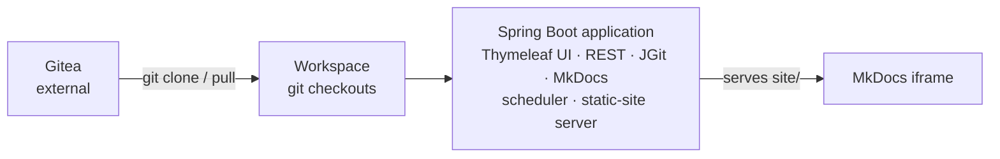

# Software Requirements Specification — Docs Portal

**Document ID:** SRS-DP-001
**Version:** 1.1
**Status:** Revised — aligned with SAS-DP-003

---

## 1. Introduction

### 1.1 Purpose

This document specifies the requirements for **Docs Portal**, a web application that aggregates Markdown documents scattered across multiple Gitea repositories, transforms them into styled HTML via an MkDocs build pipeline, and presents them through a unified documentation portal.

### 1.2 Scope

Docs Portal solves the problem of poorly navigable Markdown content distributed across many Gitea repositories. It provides:

- Automated content synchronization from Gitea repositories via git clone/pull
- MkDocs-based transformation of Markdown to HTML (Material Theme)
- MkDocs Material navigation configurable by non-developers
- Role-separated access: the theming stakeholder configures only `mkdocs.yml` and theme assets, with no access to application code, repository credentials, or the serving layer

### 1.3 Definitions

| Term | Definition |
|---|---|
| Docs Portal | The complete web application described in this document |
| Workspace | Local directory containing git-cloned source repositories |
| Build Service | Internal Spring Boot component that invokes MkDocs and publishes static HTML in `site/` |
| Backend | Spring Boot application that serves HTML, APIs, and generated documentation |
| Frontend | Thymeleaf application shell that hosts the MkDocs iframe |
| Syncer | Spring Boot component that performs git clone/pull operations |
| Theme Stakeholder | Non-developer person responsible for MkDocs theme configuration |
| Gitea | Self-hosted Git service hosting source repositories |

### 1.4 References

- Gitea REST API: https://docs.gitea.com/api/1.22/
- MkDocs: https://www.mkdocs.org/
- MkDocs Material Theme: https://squidfunk.github.io/mkdocs-material/

---

## 2. Overall Description

### 2.1 Product Perspective

Docs Portal is a standalone monolithic Spring Boot application. Git synchronization, build orchestration, REST APIs, the Thymeleaf UI, and generated-site serving run in one deployable. MkDocs is invoked by the application as a subprocess.

### 2.2 User Roles

| Role | Description |
|---|---|
| **Admin** | Configures the application: manages repository connections, triggers builds, sets authentication credentials. Has access to all system functions. |
| **Theme Stakeholder** | Configures MkDocs theme appearance via `mkdocs.yml`, custom CSS, and theme overrides. Has NO access to application code, Gitea credentials, or admin functions. |
| **Viewer** | Browses and reads documentation using the read-only account. No configuration access. |

### 2.3 Projects and Isolation

Docs Portal SHALL support multiple projects. A project is the isolation
boundary for repository configurations, the MkDocs configuration repository,
sync status, build history, work directories, generated sites, and the active
documentation iframe. The system SHALL create a **Default Project** during
initialization.

The login page SHALL list projects and require the user to select one. The
selected project SHALL be retained in the authenticated session. Admin users
SHALL be able to create, edit, and switch projects. All non-project-management
screens SHALL show only data from the selected project.

### 2.4 Operating Environment

- **Deployment:** Docker Compose on Linux
- **Gitea:** Self-hosted instance (any version supporting git protocol)
- **Browser:** Modern Chromium-based or Firefox browsers

---

## 3. Functional Requirements

### 3.1 Authentication

| ID | Requirement | Priority |
|---|---|---|
| AUTH-001 | The system SHALL require authentication for all browser and management access. The Gitea webhook endpoint is the sole exception and SHALL require a valid HMAC signature. | Must |
| AUTH-002 | Authentication SHALL use pre-configured Admin and Viewer accounts, with credentials supplied through application configuration or environment variables. | Must |
| AUTH-003 | Upon successful authentication, the system SHALL issue a session token (JWT or session cookie) with a configurable expiration time. | Must |
| AUTH-004 | Unauthenticated requests SHALL be redirected to a login page. | Must |
| AUTH-005 | Failed login attempts SHALL be rate-limited to prevent brute-force attacks. | Should |

### 3.2 Repository Management

| ID | Requirement | Priority |
|---|---|---|
| REPO-001 | The system SHALL allow Admin users to add Gitea repositories via a web UI, specifying: repository name, Gitea clone URL, branch (default: main), and one or more subdirectory paths within the repo (e.g., `docs/`, `wiki/`, `.` for root). | Must |
| REPO-002 | The system SHALL allow Admin users to edit and remove configured repositories via the web UI. | Must |
| REPO-003 | Repository configuration SHALL be persisted in a database or configuration file. | Must |
| REPO-004 | The system SHALL support authentication to Gitea via SSH deploy keys and/or HTTPS with access tokens. | Must |
| REPO-005 | The system SHALL validate the connection to a Gitea repository before saving its configuration (test clone / fetch). | Should |
| REPO-006 | The system SHALL display a list of all configured repositories with their last sync status and timestamp. | Must |
| REPO-007 | Every repository configuration SHALL belong to exactly one project and SHALL only be visible or processed in that project context. | Must |

### 3.3 Content Synchronization

| ID | Requirement | Priority |
|---|---|---|
| SYNC-001 | The system SHALL perform periodic git clone/pull operations for all configured repositories into the Workspace directory. | Must |
| SYNC-002 | If a repository does not exist locally, the system SHALL clone it. If it exists, the system SHALL pull latest changes. | Must |
| SYNC-003 | The system SHALL accept incoming webhooks from Gitea (push events) to trigger immediate synchronization. | Must |
| SYNC-004 | Synchronization errors (e.g., auth failure, network error) SHALL be logged and surfaced in the Admin UI. | Must |
| SYNC-005 | The system SHALL provide an Admin UI for creating and managing Gitea webhooks, including displaying the webhook URL and secret that must be configured in each Gitea repository. | Must |
| SYNC-006 | Upon receiving a webhook event, the system SHALL immediately pull the affected repository and trigger a rebuild. The 5-minute polling interval serves ONLY as a fallback for missed webhooks. | Must |

### 3.4 Build Pipeline

| ID | Requirement | Priority |
|---|---|---|
| BUILD-001 | The system SHALL execute `mkdocs build` after successful content synchronization. | Must |
| BUILD-002 | The build output (HTML in `site/`) SHALL be written to a directory served by the Spring Boot application. | Must |
| BUILD-003 | The Build Service SHALL run as an internal Spring Boot component and invoke MkDocs as a subprocess. | Must |
| BUILD-004 | The `mkdocs.yml` configuration, custom CSS, and theme overrides SHALL be obtained from the dedicated MkDocs configuration repository. | Must |
| BUILD-005 | During an active rebuild, the Thymeleaf UI SHALL display a rebuilding status and block interaction with the documentation iframe until the build completes. | Must |
| BUILD-006 | If a build fails, the system SHALL retain the previous successful build output and display a build-failure notification to Admin users. | Must |
| BUILD-007 | The system SHALL provide a manual build trigger accessible to Admin users. | Should |
| BUILD-008 | Builds, build records, generated site output, and build work directories SHALL be isolated by project. | Must |

### 3.5 Documentation Viewing

| ID | Requirement | Priority |
|---|---|---|
| VIEW-001 | The system SHALL display MkDocs-generated pages in a full-size iframe, including the complete MkDocs Material Theme UI (sidebar, search, table of contents, navigation). | Must |
| VIEW-002 | The iframe SHALL render the documentation exactly as MkDocs produces it — no custom rendering, no content extraction, no restyling of page content by the application. | Must |
| VIEW-003 | The application SHALL NOT render any Markdown content or documentation structure itself. All documentation rendering is the exclusive responsibility of the MkDocs build output served via iframe. | Must |
| VIEW-004 | The application MAY expose a list of generated page URLs for integrations, but SHALL NOT render an application-owned page selector or documentation navigation. | Should |
| VIEW-005 | The iframe URL SHALL be navigable within the iframe — clicking MkDocs internal links updates the iframe content, not the application page. | Must |

### 3.6 Navigation

| ID | Requirement | Priority |
|---|---|---|
| NAV-001 | The documentation navigation (sidebar, search, table of contents) SHALL be provided entirely by the MkDocs Material Theme rendered inside the iframe. | Must |
| NAV-002 | The application SHALL NOT implement its own navigation tree, sidebar, or documentation content rendering. | Must |
| NAV-003 | The Backend MAY expose an endpoint listing available documentation page URLs for integrations, but this is purely for routing convenience — not for rendering. | Should |

### 3.7 System Status

| ID | Requirement | Priority |
|---|---|---|
| STAT-001 | The system SHALL expose a health endpoint (`GET /api/health`) returning: build status (idle/building/failed), last build timestamp, last sync timestamp, and repository sync statuses. | Must |
| STAT-002 | The Thymeleaf UI SHALL display the build/rebuild status prominently to authenticated users. | Must |
| STAT-003 | While a rebuild is in progress, the Thymeleaf UI SHALL display a blocking overlay informing users that documentation is being rebuilt. | Must |

### 3.8 MkDocs Configuration Repository

| ID | Requirement | Priority |
|---|---|---|
| MKCFG-001 | The MkDocs configuration files (mkdocs.yml, custom CSS, theme overrides) SHALL be stored in a dedicated Git repository, not on the local filesystem. | Must |
| MKCFG-002 | The system SHALL allow Admin users to configure the MkDocs config repository URL, branch, and credentials via the Admin UI or application configuration. | Must |
| MKCFG-003 | The Spring Boot Build Service SHALL clone/pull the MkDocs config repository alongside the content repositories before each build. | Must |
| MKCFG-004 | The MkDocs config repository SHALL be the single source of truth for theme configuration. The Theme Stakeholder interacts with the system exclusively through this repository. | Must |
| MKCFG-005 | Each project SHALL have zero or one MkDocs configuration repository. | Must |

---

## 4. Non-Functional Requirements

### 4.1 Security

| ID | Requirement |
|---|---|
| SEC-001 | Gitea credentials (SSH keys, access tokens) SHALL be stored securely (environment variables or Docker secrets), never in version-controlled configuration files. |
| SEC-002 | The Theme Stakeholder SHALL NOT have filesystem access to the Backend source code, database, or Gitea credentials. |
| SEC-003 | The authentication password SHALL not be stored in plaintext; use hashing or environment-variable injection. |
| SEC-004 | All HTTP traffic SHOULD use HTTPS in production. |

### 4.2 Performance

| ID | Requirement |
|---|---|
| PERF-001 | Initial page load (login to visible documentation) SHALL complete within 3 seconds after a successful build. |
| PERF-002 | MkDocs full build for up to 50 repositories with 500 total Markdown files SHALL complete within 5 minutes. |
| PERF-003 | The navigation API response SHALL be under 200ms for typical navigation trees (up to 500 pages). |

### 4.3 Reliability

| ID | Requirement |
|---|---|
| REL-001 | A failed build SHALL NOT corrupt or replace the currently served documentation. The previous successful build output SHALL remain active. |
| REL-002 | The system SHALL recover from temporary Gitea unavailability and retry on the next polling cycle. |

### 4.4 Maintainability

| ID | Requirement |
|---|---|
| MAINT-001 | The application SHALL be deployable as a single Spring Boot service. |
| MAINT-002 | The `mkdocs.yml` and theme assets SHALL be configurable through the configuration repository without changing or rebuilding the application. |
| MAINT-003 | The system SHALL be deployable via a single `docker compose up` command. |

---

## 5. Constraints

| ID | Constraint |
|---|---|
| CON-001 | The system SHALL run on Docker Compose. |
| CON-002 | The Spring Boot Build Service SHALL use MkDocs (preferably with Material Theme) for HTML generation. |
| CON-003 | Content SHALL be sourced from Gitea repositories via git protocol (clone/pull), not via Gitea REST API. |
| CON-004 | The application SHALL be implemented as a Java 21 Spring Boot monolith. |
| CON-005 | The application shell SHALL be implemented with Thymeleaf; MkDocs SHALL render the documentation UI inside an iframe. |
